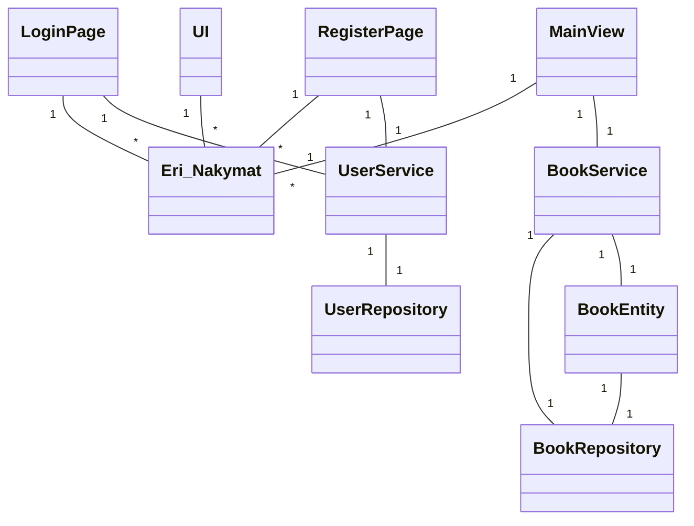
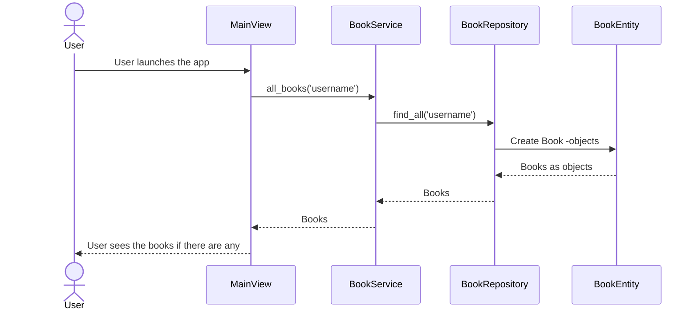
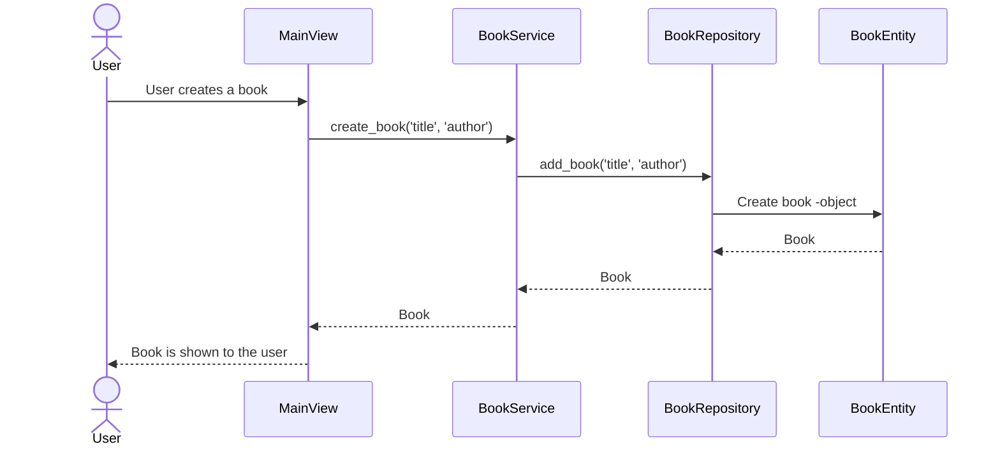
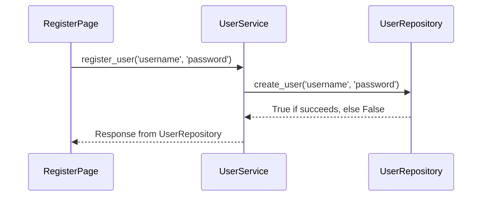
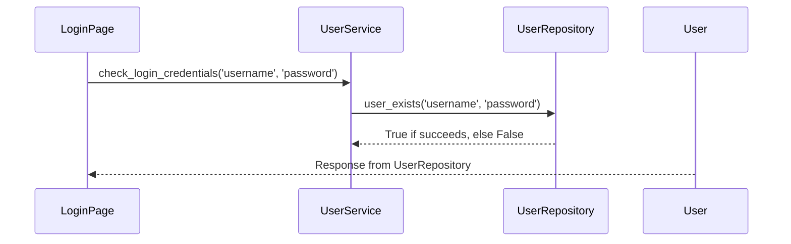

# Arkkitehtuurikuvaus sovellukselle

## Luokkakaavio rakenteelle

### Rakenteen kuvailu:

Sovellus käyttää Repository -suunnittelumallia, jossa Repository -luokka vastaa tietojen pysyväistallennuksesta, Service -luokka pääasiallisesti sovelluslogiikasta ja UI -luokka eri käyttäjälle näytettävistä graafisista komponenteista. Käyttäjiin liittyvä sovelluslogiikka ja pysyväistallennus on UserService ja UserRepository luokissa, kun taas kirjoihin liittyvä BookService ja BookRepository luokissa.

## Päätoiminnallisuudet:

Kuvataan sovelluksen eri toimintoja sekvenssimallin avulla.

### Kirjojen näyttäminen:

Kun käyttäjä rekisteröityy tai kirjautuu, päänäkymästä vastaava MainView kutsuu BookService luokan metodia, joka noutaa tietokannasta kaikki käyttäjän kirjat ja MainView näyttää ne käyttäjälle.

### Kirjan lisääminen:

Lisääminen tapahtuu vastaavalla tavalla, ja MainView saa kirja-olion, jonka se lisää kirjojen listanäkymään.

### Kirjautuminen ja rekisteröityminen

#### Käyttäjän luonti

#### Kirjautuminen

### Tietojen pysyväistallennus:

Tiedon pysyväistallennuksesta vastaavat luokat `UserRepository` ja `BookRepository`. Ne käyttävät tietokantaa, joka luodaan `initialize_database` tiedostossa. Tietokannan nimi määritetään `.env` tiedostossa. Tarkemmat ohjeet löytyvät `README.md` tiedostosta.
