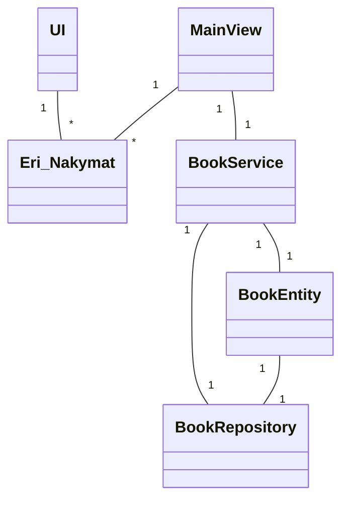
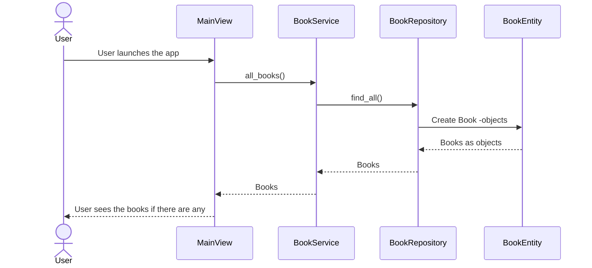
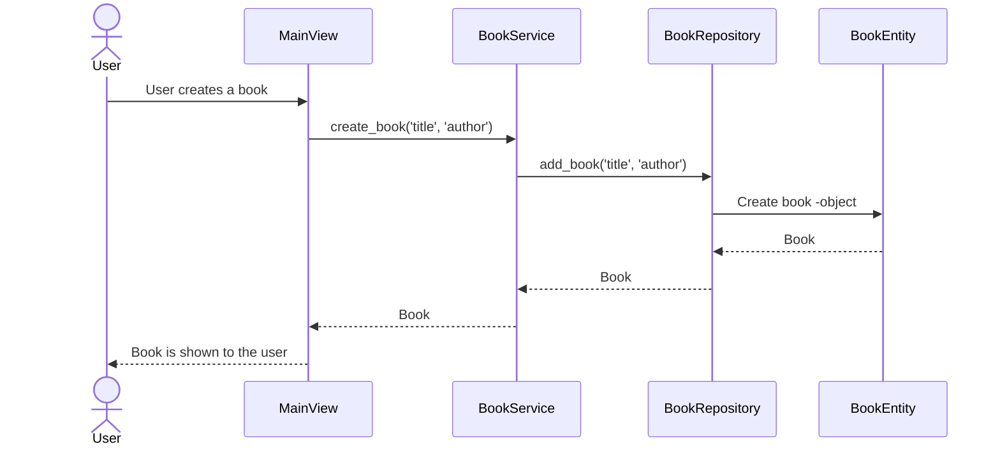

# Arkkitehtuurikuvaus sovellukselle

## Luokkakaavio rakenteelle

### Rakenteen kuvailu:

Sovellus käyttää Repository -suunnittelumallia, jossa Repository -luokka vastaa tietojen pysyväistallennuksesta, Service -luokka pääasiallisesti sovelluslogiikasta ja UI -luokka eri käyttäjälle näytettävistä graafisista komponenteista.

## Päätoiminnallisuudet:

Kuvataan sovelluksen eri toimintoja sekvenssimallin avulla.

### Kirjojen näyttäminen:

Kun sovellus käynnistetään, päänäkymästä vastaava MainView kutsuu BookService luokan metodia, joka noutaa tietokannasta kaikki kirjat ja MainView näyttää ne käyttäjälle.

### Kirjan lisääminen:

Lisääminen tapahtuu vastaavalla tavalla, ja MainView saa kirja-olion, jonka se lisää kirjojen listanäkymään.

