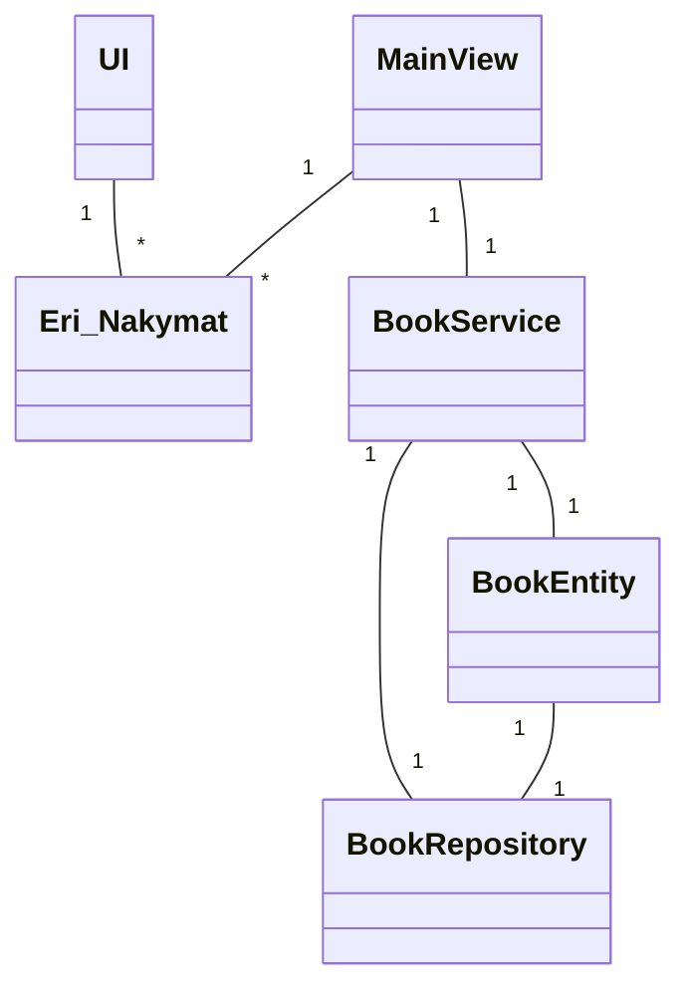

# Arkkitehtuurikuvaus sovellukselle

## Luokkakaavio rakenteelle

### Rakenteen kuvailu:

Sovellus käyttää Repository -suunnittelumallia, jossa Repository -luokka vastaa tietojen pysyväistallennuksesta, Service -luokka pääasiallisesti sovelluslogiikasta ja UI -luokka eri käyttäjälle näytettävistä graafisista komponenteista.
