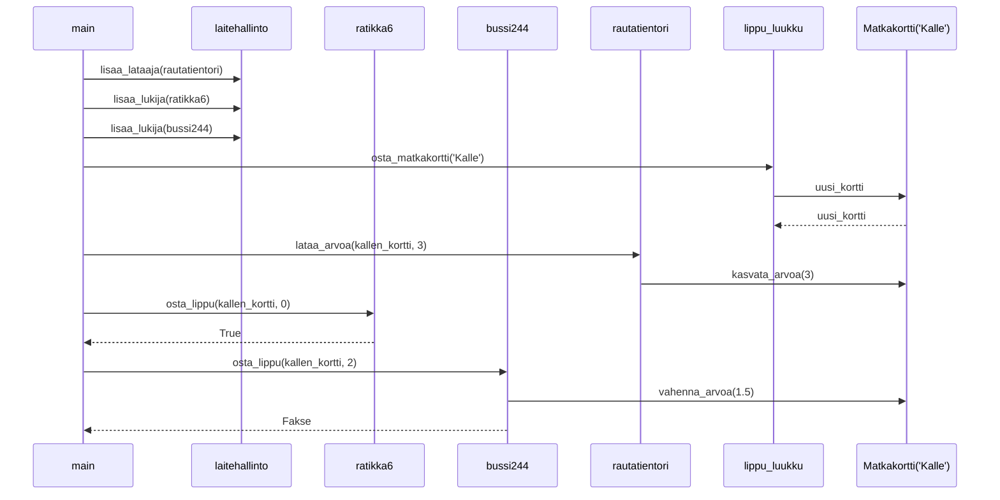

```mermaid
sequenceDiagram
    main->>laitehallinto: lisaa_lataaja(rautatientori)
    participant ratikka6
    participant bussi244
    participant rautatientori
    main->>laitehallinto: lisaa_lukija(ratikka6)
    main->>laitehallinto: lisaa_lukija(bussi244)
    main->>lippu_luukku: osta_matkakortti('Kalle')
    lippu_luukku->>Matkakortti('Kalle'): uusi_kortti
    Matkakortti('Kalle')-->>lippu_luukku: uusi_kortti
    main->>rautatientori: lataa_arvoa(kallen_kortti, 3)
    rautatientori->>Matkakortti('Kalle'): kasvata_arvoa(3)
    main->>ratikka6: osta_lippu(kallen_kortti, 0)
    ratikka6-->>main: True
    main->>bussi244: osta_lippu(kallen_kortti, 2)
    bussi244->>Matkakortti('Kalle'): vahenna_arvoa(1.5)
    bussi244-->>main: Fakse

```
